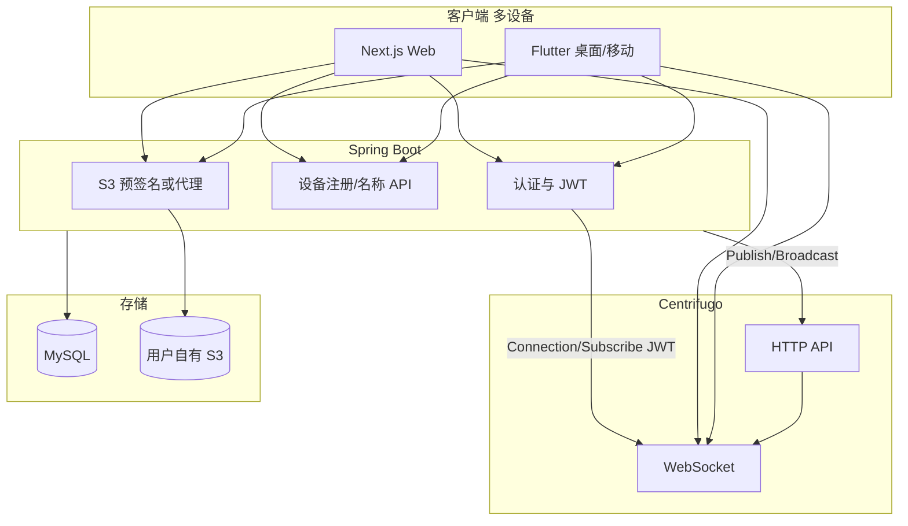

# 虾传 项目计划（完整版）

## 文档说明

本文档为虾传消息/文件中转应用的完整项目计划与设计说明，涵盖产品形态、技术选型、架构、领域模型、实时通道、文件传输策略、文件管理、UI 与交互、后端 API、项目结构、实施阶段、风险与依赖，以及附录（协议、数据库、运行说明）。

---

## 一、产品概述

**虾传** 是一款跨设备实时消息/文件中转应用：

- **核心能力**：每个用户对应一个订阅源，用户发送文本或文件后，该用户所有已登录设备均可收到。
- **文件传输**：支持两种模式——**局域网直连**（可选指定设备，点对点 WebSocket，含反向连接）与 **S3 广域网**（不指定设备或跨网时，文件先上传用户自配 S3，再通过实时通道下发链接）。
- **设备与配置**：每台设备有唯一 deviceId（不可变）与可编辑设备名称；支持文件保存策略（如是否保存到相册、是否自动删除缓存）及 S3 配置。

基于 [Centrifugo](https://centrifugal.dev/docs/server/configuration) 构建实时消息监听与推送能力。

---

## 二、技术选型

| 端 | 技术 | 说明 |
|----|------|------|
| **Web** | Next.js (React) | 主入口之一，聊天式 UI，使用 Centrifuge.js 订阅实时频道 |
| **跨平台客户端** | Flutter | 支持桌面端（macOS、Windows、Linux）及移动端（iOS、Android），相册/文件能力通过 Flutter 插件实现 |
| **后端** | Spring Boot (Java 17) | 认证、Centrifugo JWT 签发、设备与 S3 相关 API，调用 Centrifugo HTTP API 发布消息 |
| **数据库** | MySQL 8 | 用户、设备、S3 配置等持久化 |
| **实时** | Centrifugo | WebSocket + HTTP API，沿用项目内 `config.json` 配置 |

---

## 三、架构总览



- **用户维度**：每个用户对应一个 Centrifugo 用户频道 `user#<userId>`，仅该用户的连接可订阅；该用户所有已登录设备订阅同一频道，实现「每用户一个订阅源、多端收同一份消息」。
- **消息流**：设备发消息 → 后端 → 调用 Centrifugo HTTP API 的 publish → 发布到 `user#<userId>` → 该用户所有设备（含发送端）收到。

---

## 四、核心领域模型

| 概念 | 说明 |
|------|------|
| **用户** | 账号体系（登录后得到 userId），用于认证与频道归属。 |
| **设备** | 每台设备唯一 **deviceId**（不变）、可编辑 **设备名称**；设备在首次使用或登录时向后端注册，并可上报用于 LAN 的 WebSocket 地址（如 `ws://本机IP:port`）。 |
| **消息** | 文本消息 + 文件消息；文件消息在 LAN 模式下可只带发送方/接收方等元数据，在 WAN 模式下带 S3 的 key 或后端提供的下载 URL。 |

---

## 五、实时通道设计（Centrifugo）

- **频道命名**：`user#<userId>`（Centrifugo 用户受限频道，仅 `sub` 为对应用户的 connection 可订阅）。
- **连接**：客户端使用后端下发的 **Connection JWT**（`sub` = userId），并订阅 `user#<userId>`（需 **Subscription JWT**，channel 为 `user#<userId>`）。
- **服务端发布**：后端使用 `config.json` 中的 `http_api.key` 调用 Centrifugo HTTP API 的 `publish`，将消息发到 `user#<userId>`。
- **消息体结构**：统一 envelope，例如：
  - `{ "type": "text"|"file"|"control", "payload": {...}, "fromDeviceId": string, "ts": number }`
  - `control` 用于「反向连接」等信令。

参考：[Centrifugo 配置](https://centrifugal.dev/docs/server/configuration)、[Server API](https://centrifugal.dev/docs/server/server_api)。

---

## 六、文件传输策略

### 6.1 两种模式

- **局域网模式**：用户**选择特定一个或几个设备**作为接收端时启用；优先点对点 WebSocket 传文件（先尝试直连，失败可走「反向连接」）。
- **广域网模式**：用户**不选择设备**（即发给「我的所有设备」）或不在同一局域网时启用；文件先上传到**用户自配 S3**，再通过 Centrifugo 下发文件 key/URL，各端从 S3（或经后端预签名 URL）下载。

### 6.2 局域网直连与反向连接

- 每个设备可在局域网内运行 **WebSocket 服务** 用于接收文件；设备将「可被连接的 WS 地址」随上线/心跳通过后端写入设备元数据（如 `lanWsUrl`），供同用户其他设备在「选择设备」时使用。
- **发送流程**：
  1. 发送方根据目标设备的 `lanWsUrl` **先尝试主动连接** 目标设备（A 连 B）。
  2. 若 A 连 B 失败（NAT/防火墙等），但 B 可以连 A：则通过 Centrifugo 下发一条 **control** 消息（如 `reverse_connect`），payload 中携带 **A 的 WS 地址**；**B 收到后作为客户端主动连接 A**，建立连接后由 A 通过该连接把文件推给 B。
- 协议层需约定：谁在何时作为 server/client，以及「反向连接」建立后的第一条消息（例如 B 发 `ready`，A 再发文件流或分块元数据）。详见附录「局域网文件传输协议」。

### 6.3 S3 广域网流程

- 用户在前端配置自己的 S3（Endpoint、Bucket、Key/Secret 等），由后端保存并用于生成**预签名 URL**；上传由客户端直传 S3，不在客户端存 S3 密钥。
- 发送文件时：客户端向后端获取上传预签名 URL → 直传 S3 → 得到 key → 通过 Centrifugo 发送 `type: "file"` 消息，payload 含 key、fileName、size；各端收到后根据需要向后端请求下载预签名 URL，再下载文件，并根据策略决定是否保存到相册、是否删除缓存。

---

## 七、文件管理与本地策略

- **设置项**（可存本地或同步到后端/用户级）：
  - **图片/视频是否自动保存到相册**：主要移动端生效；Web 可为「下载到本地目录」或仅在线查看。
  - **自动保存到相册时，是否自动删除缓存文件**：避免重复占用空间。
- **实现要点**：文件先落盘到 App 缓存目录；若开启「保存到相册」，则写入系统相册后，根据开关决定是否删除缓存文件。Flutter 端可使用 `image_gallery_saver`、`path_provider` 等；Web 端仅下载或在线查看。

---

## 八、UI 与交互

- **登录后主界面**：即 **聊天对话框**（与「自己」的会话：自己发、多端收）。顶部可展示当前设备名称与「我的设备」「设置」入口。
- **输入**：支持文本输入 + 附件（选择文件/图片/视频）；发送时若是文件且选择了「指定设备」，则走局域网逻辑，否则走 S3 广域网。
- **设备管理**：独立页面，展示当前用户设备列表（设备名可编辑、deviceId 只读），可修改本机名称；列表可用于「选择接收设备」时的目标选择。
- **设置**：文件保存策略（保存到相册、保存后是否删缓存）、S3 配置入口等。

---

## 九、后端 API 与职责（Spring Boot）

- **认证**：登录/注册，返回 access/refresh token；**签发 Centrifugo 用 JWT**（connection + subscription，channel 固定为 `user#<userId>`）；使用 Spring Security + JWT（如 jjwt），Centrifugo JWT 使用与 `config.json` 一致的 HMAC 密钥。
- **设备**：注册设备（deviceId、名称、可选 lanWsUrl）、更新设备名称、拉取本用户设备列表。
- **文件（广域网）**：S3 配置的保存与校验；生成**上传用预签名 URL**与**下载用预签名 URL**；密钥仅存后端。
- **消息**：接收客户端发来的消息体，调用 Centrifugo HTTP API 的 publish 发布到对应用户频道；可选是否在后端或 Centrifugo 做历史持久化，当前以实时推送 + 客户端本地展示为主。

---

## 十、项目结构

```
ultrasend/
├── config.json           # Centrifugo 配置
├── backend/              # Spring Boot 后端
│   ├── src/main/java/    # 认证、JWT、设备、S3、Centrifugo HTTP 客户端
│   ├── scripts/          # schema.sql 等
│   └── build.gradle.kts
├── web/                  # Next.js Web 端
│   ├── app/              # App Router
│   └── src/lib/          # API、Auth、Centrifuge 等
├── app/                  # Flutter 跨平台（桌面 + 移动）
│   └── lib/
├── shared/               # 协议说明（如 protocol.md）
├── docs/                 # 项目文档（本文档等）
└── docker-compose.yml    # Centrifugo + MySQL + 后端
```

- `config.json` 已包含 `client.token.hmac_secret_key`、`http_api.key`、`admin`；生产环境需改用环境变量或密钥管理，并配置 `allowed_origins`。

---

## 十一、实施阶段建议

| 阶段 | 内容 |
|------|------|
| **Phase 1 - 基础实时与多端** | 后端：认证 + Centrifugo JWT 签发 + 设备注册/列表；前端：登录、订阅 `user#<userId>`、发送/接收文本消息，主 UI 为聊天框；验证多端同时在线收同一消息。 |
| **Phase 2 - 文件广域网（S3）** | 后端：S3 配置与预签名；前端：选择文件 → 上传 S3 → 发 file 消息（带 key）→ 各端展示与下载；设置项：下载/保存路径。 |
| **Phase 3 - 局域网与反向连接** | 设备上报 lanWsUrl；发送文件时「选择设备」→ 先尝试直连，失败则发 `reverse_connect`，接收端连回发送端完成传输；统一消息格式中的 control 类型与 payload。 |
| **Phase 4 - 文件策略与 Flutter 端** | 设置：保存到相册、保存后删缓存；Flutter 端实现相册写入与缓存清理；设备名称编辑与展示优化。 |
| **Phase 5 - 体验与运维** | 错误提示、重试、离线队列（可选）、Centrifugo 与后端的监控/日志、Docker Compose 等。 |

---

## 十二、风险与依赖

- **NAT/防火墙**：反向连接能覆盖「B 能连 A、A 不能连 B」的场景；若双向均不可达，只能退回到 S3 模式，需在 UI 上对用户做简单说明。
- **S3 配置**：密钥仅后端持有；需注意跨域与预签名策略。
- **Flutter 桌面**：macOS/Windows/Linux 需各自处理 LAN WebSocket 监听与系统能力；相册能力主要在移动端，桌面端以「保存到本地目录」为主。

---

## 附录 A：局域网文件传输协议

（与 `shared/protocol.md` 一致）

### WebSocket 服务端（接收端，如 Flutter 桌面）

- 设备在局域网内启动 WebSocket 服务，监听端口（如 8765），并将 `ws://<本机IP>:8765` 上报到后端的设备 `lanWsUrl`。
- 接收连接后，先收一条文本帧：JSON `{ "type": "file", "fileName": string, "size": number }`，再收一条二进制帧为文件内容。

### WebSocket 客户端（发送端）

- 连接接收端的 `lanWsUrl`，先发送一条文本帧（上述 JSON），再发送一条二进制帧（文件内容），然后关闭连接。

### 反向连接（reverse_connect）

- 当发送方 A 无法连接接收方 B 的 WS 时，通过 Centrifugo 下发 control 消息：`{ "type": "control", "payload": { "action": "reverse_connect", "wsUrl": "ws://A的地址", "fileId": "...", "fileName": "...", "size": number }, "fromDeviceId": "A", "ts": number }`。
- 接收方 B 收到后，作为客户端主动连接 A 的 WS 地址，连接建立后 B 发送 `ready`，A 再发送文件（同上：JSON + binary）。

---

## 附录 B：数据库（MySQL）

- **数据库名**：`ultrasend`，字符集 `utf8mb4`。
- **建表脚本**：`backend/scripts/schema.sql`（建库 + 建表）。
- **主要表**：
  - **users**：id, username（唯一）, password_hash
  - **devices**：id, device_id, name, lan_ws_url, user_id（外键），唯一约束 (user_id, device_id)
  - **s3_config**：id, user_id（唯一外键）, endpoint, region, bucket, access_key_id, secret_access_key
- 后端默认连接：`jdbc:mysql://localhost:3306/ultrasend`，用户名/密码可通过 `SPRING_DATASOURCE_*` 环境变量覆盖。

---

## 附录 C：运行说明摘要

1. **配置**：`./scripts/setup-local-config.sh`（贡献者）或 `./scripts/deploy-local.sh`（维护者，含建库）。
2. **本地全栈**：`./scripts/start-dev.sh`（国内）或 `./scripts/start-dev.sh --overseas`（海外）；停止 `./scripts/stop-dev.sh`。
3. **生产**：`./scripts/deploy.sh`（见 [SELF_HOST.md](SELF_HOST.md)）。
4. **Docker Compose**：`docker compose up -d` 可启动 MySQL、Centrifugo、后端；Web 用 `./scripts/start-dev.sh` 或 `cd web && npm run dev`。

更详细的步骤见 [README.md](../README.md)（英文）与 [docs/README.zh-CN.md](README.zh-CN.md)（中文）。
