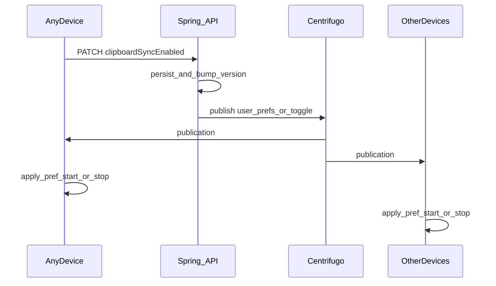
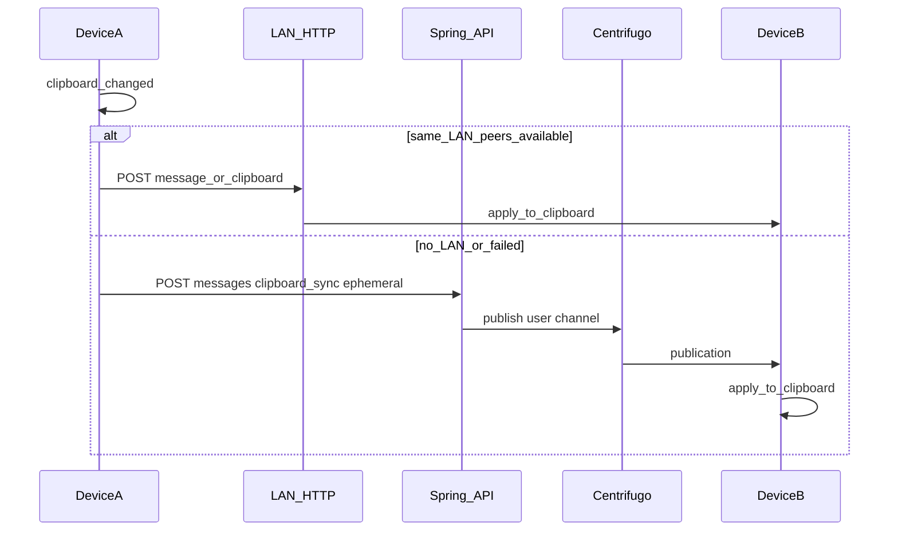

# 剪贴板自动同步方案（设计文档）

> **状态**：设计稿，**待开发**。本文档供后续实现对照，不包含实现代码。  
> **摘要**：在 ultrasend 现有 **局域网 HTTP（含 `POST /message`）**、**mDNS（bonsoir）**、**JWT API** 与 **Centrifugo `user#<userId>`** 之上，采用 **局域网优先 + 云端兜底**；**总开关为账号级**（服务端权威，全端跟随）；桌面与手机能力边界需在文案与验收中区分。

---

## 开发任务清单（Checklist）

- [ ] 将 `LanReceiver` + Centrifugo 最小订阅从 `ChatScreen` 抽为应用级单例/服务；**登录且账号级偏好为「开」**时启动剪贴板同步子系统
- [ ] 剪贴板变更 → 对已知 peer 的 `lanHttpUrl` `POST`（复用 `/message` 或新增 `/clipboard`）+ 本机去重
- [ ] 后端：`clipboard_sync`（载荷）加入 `EPHEMERAL_TYPES`；与账号偏好变更广播共用 `user#` 订阅，客户端分支处理
- [ ] 后端：用户维度存储 `clipboardSyncEnabled`（及 `updatedAt`/`version`）；`GET` 供冷启动/恢复；`PATCH` 后 `publishToUser` 发 ephemeral（如 `user_prefs` / `clipboard_sync_toggle`），各端立即对齐 UI 与启停逻辑
- [ ] 设置页：账号级同一开关 + 副文案「对所有已登录设备生效」+ 首次开启风险说明 + 大小上限等；失败时乐观更新回滚
- [ ] 验证托盘/无聊天页时仍监听与同步
- [ ] 信令可靠性：Centrifugo 重连、幂等 hash；可选二期 APNs/FCM 静默唤醒（仅触发拉取，不传剪贴板正文）
- [ ] 接收远端剪贴板：轻量 Toast/免打扰；冲突策略 LWW

---

## 现状（与方案强相关）

- **局域网传输栈**：[`app/lib/lan/lan_receiver.dart`](../app/lib/lan/lan_receiver.dart) 本地 HTTP 提供 `POST /message`（JSON：`text`、`fromDeviceId`、`fromDeviceName`）；[`app/lib/lan/transfer_worker.dart`](../app/lib/lan/transfer_worker.dart) 中 `_handleMessagePost` 已解析并回调主 Isolate。
- **发现**：[`app/lib/lan/lan_discovery.dart`](../app/lib/lan/lan_discovery.dart) 使用 `bonsoir`（`_ultrasend._tcp`）。
- **云端实时通道**：后端 `CentrifugoPublishService` 向 `user#<userId>` 发布；`MessageService.send` 中非 ephemeral 会落库，`EPHEMERAL_TYPES` 仅广播、不写库（已有 `lan_*`、`webrtc_*` 等）。
- **缺口**：Centrifugo 与 `LanReceiver` 目前主要在 [`app/lib/screens/chat_screen.dart`](../app/lib/screens/chat_screen.dart) 启动；桌面托盘虽可常驻，**未进聊天页则无 LAN 服务、无 Centrifugo 订阅**——自动同步需 **应用级生命周期**。

---

## 方案空间（简表）

| 方向 | 优点 | 缺点 | 与本项目契合度 |
|------|------|------|----------------|
| **纯局域网** | 低延迟、不经服务器存储 | 跨网段不可用 | **高** |
| **纯云端轮询** | 可跨网络 | 延迟/成本；隐私设计重 | 中 |
| **混合：LAN 优先 + 云端兜底** | 同网快、跨网可同步、可不落库 | 路径选择 + 去重 | **最高** |

---

## 稳定可靠性与「系统消息服务」

### 系统跨设备剪贴板（iCloud / 微软云剪贴板）

- 各生态内省心，但第三方应用**无法**作为统一可编程总线依赖；可作产品说明中的**补充建议**，主方案仍为自研 LAN + 自有信令。

### 可借用的「消息」能力

1. **Centrifugo（WSS）**：作为可靠信令；可 **信令与载荷分离**（云上 hash/version，正文走 LAN 或 HTTPS 拉取）。
2. **系统推送（APNs/FCM）**：仅适合 **唤醒/补拉**，不宜承载剪贴板正文。
3. **本机进程内通知**：只解决单机模块协作，不解决跨设备。

### 验收语义

- **送达**：至少 at-least-once；接收端用 `contentHash` + `fromDeviceId` + `ts`（或 `seq`）**幂等**去重。
- **降级**：同网 LAN → 失败再走云信令。
- **托盘/后台**：桌面依赖应用级常驻；手机以前台为主。

---

## 产品与交互：账号级单开关 · 全端跟随

### 开关定义

- **权威数据**：`clipboardSyncEnabled`（+ `version`/`updatedAt`）存 **服务端用户维度**；客户端仅缓存。
- **全端跟随**：任意已登录设备 `PATCH` 成功后，经 **`publishToUser` ephemeral** 通知所有在线端：**更新设置 UI**、**启停剪贴板监听与发送**。
- **离线端**：下次登录/冷启动/恢复前台（可节流）**GET** 对齐。

### 首次将账号开关设为「开」

- 风险说明（建议按 `userId` 只强提示一次，或服务端记 `clipboardRiskAcceptedAt`）。
- 确认后：`PATCH` → 服务端写库 → 广播 → 各端进入开启行为。
- 系统权限失败：**不提交 PATCH** 或回滚，开关回到关。

### 用户拨动开关（任意一端）

- 可选乐观 UI，失败回滚。
- **并发**：以服务端最后一次成功写入为准；可用 `expectedVersion`，冲突 `409` 后拉取最新。

### 常态行为（账号已为「开」）

| 场景 | 桌面 | 手机 |
|------|------|------|
| 前台 | 剪贴板变更对外同步；远端写入本机 | 同左（受系统剪贴板 API 限制） |
| 后台/锁屏 | 托盘未退出时可继续 | 能力显著受限；副文案说明「通常需打开应用」 |
| 进程被杀 | 依 OS | 恢复后拉偏好并重连 WSS |

### 其他交互

- 接收成功：可选 Toast「已从 [设备名] 更新剪贴板」；账号被其他端关闭：可选轻提示。
- **不与聊天混用**：不自动打开聊天、不把剪贴板当聊天消息（除非独立调试开关）。

### 剪贴板内容冲突（多端同时复制）

- **LWW**（服务端时间或单调 `seq`）；重复 `contentHash` 丢弃。
- 不做与「账号级统一」矛盾的 per-device「仅收不发」（除非未来另立产品故事）。

### 账号开关关闭

- 广播后各端停止剪贴板子逻辑；Centrifugo 连接可保留给聊天等功能。

#### 账号偏好变更时序（示意）

---

## 技术方案：混合 LAN + 云端

1. **LAN（优先）**：监听剪贴板 → 向已注册 peer 的 `lanHttpUrl` `POST`（`/message` 或专用 `/clipboard`）；**自动同步**应写系统剪贴板，而非插入聊天气泡。
2. **云（兜底）**：`MessageEnvelope.type = clipboard_sync`（**ephemeral**），载荷含 `fromDeviceId`、`contentHash`、`ts`、`mime` 等；文本可内联或短链拉取（隐私）。
3. **路径选择**：有可达 LAN peer → 优先 LAN；否则 `POST /api/messages` → Centrifugo。

### 剪贴板载荷路径（示意）

---

## 关键工程要点

- **应用级服务**：`LanReceiver` + Centrifugo 处理 **偏好广播 + clipboard 载荷 + 现有 ephemeral**；**仅当账号级偏好为开** 时跑剪贴板监听与 LAN 剪贴板相关能力；偏好为关则停剪贴板子逻辑。
- **回声控制**：本机 `Clipboard.setData` 会再次触发监听 → `lastAppliedHash`、`ignoreWindowMs`、标记「远端写入」等。
- **隐私**：默认纯文本、大小上限（如 64KB）、风险文案；二期可议 E2E。
- **一期范围**：文本为主；图片/文件可走 S3 预签名 + 信封元数据（二期）。
- **移动端**：详见上文表格；工程优先保证 **桌面托盘 + 手机前台**。

---

## 不建议从零引入

- 不必单独 Firebase/Supabase。
- 剪贴板内容**默认不落库**；用 ephemeral + 可选本地短期缓存（若做需加密与过期）。

---

## 实施顺序建议

1. **后端账号偏好**：存储 + `GET`/`PATCH`；`PATCH` 后 `publishToUser` ephemeral（列入 `EPHEMERAL_TYPES`）。
2. 客户端：登录拉偏好；`user#` 上处理偏好变更与 `clipboard_sync`；设置页绑定 `PATCH`。
3. `ClipboardSyncService`：按账号偏好启停监听、去重。
4. 抽离 `LanReceiver` 与 Centrifugo，与 `ChatScreen` 共享单例。
5. LAN：`POST` + 写剪贴板；发送前确认账号偏好仍为开（防竞态）。
6. 后端：`clipboard_sync` 入 `EPHEMERAL_TYPES`；可选校验 `fromDeviceId` 属于当前用户且偏好为开。
7. 多设备验收：一端改开关，多端 UI 与行为一致；桌面托盘场景联调。

---

## 相关代码路径（实现时查阅）

| 区域 | 路径 |
|------|------|
| LAN 接收 | `app/lib/lan/lan_receiver.dart`, `app/lib/lan/transfer_worker.dart` |
| mDNS | `app/lib/lan/lan_discovery.dart` |
| Centrifugo 客户端 | `app/lib/api/centrifugo.dart`, `app/lib/screens/chat_screen.dart` |
| 桌面托盘 | `app/lib/services/desktop_tray_lifecycle.dart` |
| 后端发布 | `backend/.../CentrifugoPublishService.java`, `MessageService.java` |
