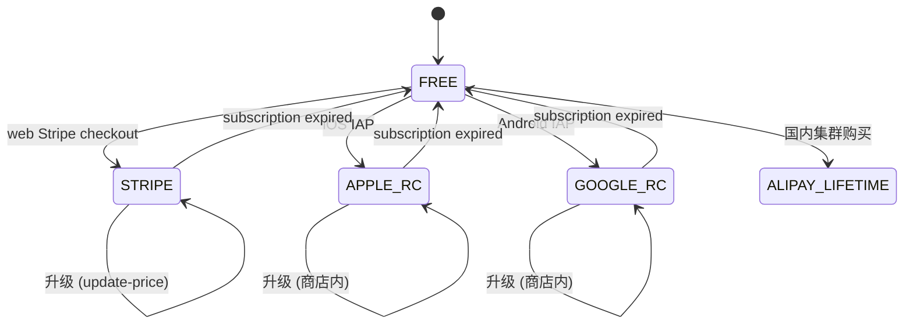
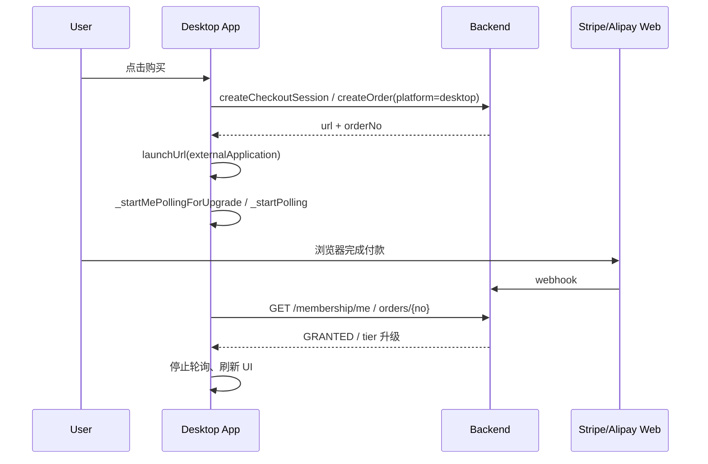

# 买断会员与支付

## 概述

- **档位**：新用户仅开放 **Pro** 买断（12 台 / 60 元）。**Mini** 已停售；存量 Mini 用户仍显示 Mini 档位，**客户端不再提供 Mini 新购或 Mini→Pro 升级**，仅可增购。增购规则不变。
- **增购**：开通 Mini 或 Pro 后，可多次购买「增购包」：每包 +5 台设备 / 45 元，设备上限 = 档位基础数 + 增购包数×5。FREE 用户不可购买增购。
- **iOS**：在售 IAP 仅 **Pro 终身**（`ultrasend_pro_lifetime`）与 **增购包**（`ultrasend_addon_5_devices`）。`ultrasend_mini_lifetime` / `ultrasend_mini_to_pro_upgrade` 仅后端 webhook 兼容存量订单，客户端不触发。Android / Web：支付宝。

## 环境变量与配置

### 后端 `application.yml` / 环境变量

- `app.membership.free-device-limit`: 未付费用户设备上限，默认 3。
- `app.membership.alipay.return-url`: 支付宝支付完成同步跳转 URL；国内本地默认见 `application.yml`，生产见 `application-prod.yml`；可用环境变量 `ALIPAY_RETURN_URL` 覆盖。
- `app.membership.alipay.public-key`: 支付宝公钥，验签回调；为空则仅 mock。
- **APP 支付（手机端调起支付宝 APP）**：需在支付宝开放平台创建「移动应用」并配置：
  - `app.membership.alipay.app-id`: 应用 APPID。
  - `app.membership.alipay.private-key`: 应用私钥（RSA2）。
  - `app.membership.alipay.alipay-public-key`: 支付宝公钥（与 WAP/回调公钥可同可不同，按开放平台说明）。
  - `app.membership.alipay.notify-url`: 异步通知地址（可与 WAP 共用同一 notify 接口）。
  - **应用须上线**：正式环境收款前，该移动应用需在开放平台通过审核并**上线**，并签约「APP 支付」；未上线时仅沙箱环境可用。
- **本地调试支付宝异步通知（ngrok）**：当 Spring **未**激活 `prod` 时，SDK 下单里的 `notify_url` 会优先使用 `app.membership.alipay.local-notify-url` 或环境变量 **`ALIPAY_LOCAL_NOTIFY_URL`**（完整 HTTPS，含路径，如 `https://xxxx.ngrok-free.dev/api/membership/alipay/notify`）。须同时满足：
  1. 与当前 ngrok 隧道域名一致（免费子域会变，换隧道后需改环境变量并**重新下单**，旧订单里的 `notify_url` 不会变）。
  2. 本机执行 **`ngrok http 9000`**，与 `server.port` 一致；**不要** `ngrok http 3000`（前端端口收不到支付宝表单 POST，ngrok 会 **502**，IDE 里 Java 断点也不会进）。
- `app.membership.alipay.mock-notify-enabled`: 为 true 时可用 mock 回调测试。
- `app.membership.revenuecat.webhook-auth`: RevenueCat Webhook 鉴权 Bearer 前缀密钥。
- `app.membership.rc-product-mini` / `rc-product-pro` / `rc-product-pro-upgrade` / `rc-product-addon-5`: RC 商品 ID，与 App Store Connect 及 RC 后台一致（`rc-product-mini` / `rc-product-pro-upgrade` 仅 webhook 兼容存量订单，客户端不再购买）。
- `app.membership.addon-price-cent`: 增购包价格（分），默认 4500（45 元）。
- `app.membership.addon-devices`: 每包增加设备数，默认 5。
- `app.membership.reconcile-delay-ms`: 已支付未发放订单补偿任务间隔（毫秒），默认 300000。

### Flutter 编译参数（可选）

- RevenueCat 公钥见 `app/lib/config/env.secrets.dart`（gitignored，ops sync）与 `env.dart`：**debug/profile** 用 Test Store key；**release** 按 flavor 选 Apple/Google 公钥。
- 构建时可通过 `RC_APPLE_API_KEY_CN`、`RC_APPLE_API_KEY_INTL`、`RC_GOOGLE_API_KEY` 环境变量覆盖（见 [revenuecat-cn-ios-setup.md](./revenuecat-cn-ios-setup.md)）。
- `RC_PRODUCT_PRO` / `RC_PRODUCT_ADDON_5`: 与后端一致的 RC 商品 ID，默认见 `app/lib/config/env.dart`（`RC_PRODUCT_MINI` 可选，仅文档/调试；客户端不购买 Mini）。
- 出海订阅：`RC_PLUS_MONTHLY` … `RC_ULTRA_YEARLY`（默认 `shrimpsend_*`）。
- 国内 iOS RC 配置与 E2E 清单见 [revenuecat-cn-ios-setup.md](./revenuecat-cn-ios-setup.md)。
- 完整出海 RC 配置与 E2E 清单见 [revenuecat-overseas-setup.md](./revenuecat-overseas-setup.md)。

## 回调与安全

- 支付宝异步通知：`POST /api/membership/alipay/notify`，表单编码，需验签；生产关闭 mock、配置公钥。
- RevenueCat Webhook：`POST /api/membership/revenuecat/webhook`，配置 RC 后台 URL 与 webhook 鉴权。
- Stripe（海外网页订阅）：`POST /api/membership/stripe/webhook`，验 Stripe-Signature；本地调试见 [stripe-local-debug.md](./stripe-local-debug.md)。
- 两回调已在 `SecurityConfig` 中放行（无需 JWT），仅依赖各自验签/鉴权。

## 历史用户与迁移

- 新用户默认无 `membership_entitlements` 记录，按 `free-device-limit` 限制设备数。
- 已有设备数超过当前限制的用户：允许保留已绑定设备，禁止新增直至升级（DeviceService 校验）。

## 跨平台渠道亲和（payment_channel）

海外集群同时存在两条订阅链路：移动端走 RevenueCat（APPLE_RC / GOOGLE_RC），网页走 Stripe。为避免同一用户在不同端各开一份订阅（双扣款），后端在 `membership_entitlements` 记录 `payment_channel`，规则如下。

### 渠道枚举

| 值 | 来源 | 备注 |
|---|---|---|
| `FREE` | 未付费 | 可在任一端开通 |
| `APPLE_RC` | iOS App Store via RevenueCat | 仅在 iPhone/iPad 内升级 |
| `GOOGLE_RC` | Android Play via RevenueCat | 仅在 Android 设备内升级 |
| `STRIPE` | 网页 Stripe Checkout | Web / 桌面浏览器升级；移动端只展示「网页管理」按钮 |
| `ALIPAY_LIFETIME` | 国内集群支付宝终身买断 | 与海外订阅不共用 |

### 合法状态转移



跨渠道切换不支持直接迁移：用户需先在当前渠道取消订阅、等到周期结束 `payment_channel` 回到 `FREE`，再在目标渠道下单。

### 冲突检测

`OverseasSubscriptionService.upsertSubscription` 在写入前比较 `existing.paymentChannel` 与 `incomingChannel`：

- 若两侧都活跃（subscriptionExpiresAt 未到期）且渠道不同，向 `subscription_conflicts` 表写一行。
- 以较长的过期时间为准；不清空另一渠道的 external ref（保留 `stripe_subscription_id`），方便运营查到双订阅源头。
- 日志带 `userId / existingChannel / incomingChannel / expiry` 便于告警。

### Webhook 写入

- RevenueCat 解析 payload 中的 `store` 字段：`APP_STORE` → `APPLE_RC`，`PLAY_STORE` → `GOOGLE_RC`，缺省按 `APPLE_RC` 处理。
- Stripe Checkout / customer.subscription.updated 一律写 `STRIPE`。
- 国内支付宝订单写 `ALIPAY_LIFETIME`，RC 国内（iOS 终身）写 `APPLE_RC`。

### `/api/membership/cross-platform-hint`

供客户端获取「该去哪个端管理」的提示。返回字段：

```json
{
  "paymentChannel": "STRIPE",
  "manageTarget": "STRIPE_WEB",
  "webMembershipUrl": "https://shrimpsend.com/settings/membership",
  "messageKey": "membership.channelLockedStripe"
}
```

App 端 `MembershipChannelGuard` / Web 端 `decideMembershipPurchase` 是同语义的纯函数实现，决定每个购买/管理按钮在当前渠道下是允许、禁用还是重定向。

## 桌面端（macOS / Windows / Linux）支付路径

桌面端没有原生 IAP 通道，统一跳系统浏览器完成付款，App 后台轮询 `/membership/me` 直至 tier 升级或 5 分钟超时。

### 海外集群（Stripe）

1. App 端调 `POST /api/membership/stripe/create-checkout-session`，请求体带 `platform=desktop-{macos|windows|linux}`。
2. 后端在 `success_url` 中追加 `session_id={CHECKOUT_SESSION_ID}` 与 `platform` query，便于回流页区分桌面用户并展示「返回 App」提示。
3. App 拿到 `url` 后 `launchUrl(externalApplication)` 打开浏览器；同步启动每 4 秒一次的 `_startMePollingForUpgrade`，看到 `tierCode` 升级即停止。
4. 升级（同渠道）路径直接调 `POST /api/membership/stripe/subscription/update-price`，由后端按比例折算。
5. 「管理订阅」按钮始终走 `POST /api/membership/stripe/billing-portal-session`，在浏览器打开 Customer Portal。

### 国内集群（支付宝 PC 网页支付）

1. 后端新增 `AlipayPagePayService.createPagePayUrl`，调 `AlipayTradePagePay`（`pageExecute("GET")`）拿到签名后的网页支付 URL。
2. `MembershipCreateOrderResponse` 增加字段 `alipayPcPayUrl`；桌面 App 优先使用，向后兼容 `alipayPayUrl`（WAP）。
3. App 端打开浏览器 → 用户在支付宝 PC 网页完成扫码/登录付款 → 异步通知 `POST /api/membership/alipay/notify`。
4. App 轮询 `getMembershipOrder(orderNo)`，状态变为 `GRANTED` 即刷新。
5. **Web 会员页**：点击购买时在用户手势内同步打开空白新标签，订单创建后仅在该标签导航至 `alipayPcPayUrl` / `alipayPayUrl`；原页保持 `/settings/membership` 并轮询订单。支付完成经 `return-url` 回到会员页。

### 时序（无 URL Scheme 唤起的兜底）



可选优化：注册 `ultrasend://payment-success?orderNo=...` URL Scheme，让 Stripe `success_url` 跳转到中间页触发 scheme，App 即时被唤起。目前未实现，使用 5 分钟轮询兜底。

## 故障排查

- 支付成功但权益未到账：查 `membership_orders` 状态、`membership_order_events` 是否已记录；补偿任务会定期处理状态为 PAID 的订单并重试发放。
- 设备数超限报错：提示“当前会员最多绑定 N 台设备”，引导用户至会员中心升级。
- 用户报告「同时被 App Store 与 Stripe 各扣一笔」：查 `subscription_conflicts`；按 `incomingChannel` / `existingChannel` 定位用户后引导其在两个渠道之一取消订阅，必要时按客服流程退款。

## 运营 FAQ

- **Q：用户想从 App 订阅切到 Stripe 怎么办？**
  A：等当前 App Store 订阅周期结束（或用户主动到 App Store 取消并等到期），`payment_channel` 落到 `FREE` 后即可在网页 Stripe 重新订阅。客服可在 `membership_entitlements` 查询当前 `payment_channel` 与 `subscription_expires_at`。
- **Q：iOS 用户在桌面看不到购买按钮怎么办？**
  A：检查后端是否海外集群；桌面端无原生 IAP，必须 `Env.stripePriceIdForTierCode` 与后端 `app.membership.overseas.stripe-price-*` 都已配置才能进入 Stripe Checkout。
- **Q：海外网页 Stripe 提示「未知 Stripe Price」？**
  A：浏览器请求里的 `priceId` 必须与后端 `application-prod-overseas.yml`（或服务器 `STRIPE_PRICE_*`）里六个 Stripe Price ID 完全一致。Web 在 [`web/.env`](../web/.env) 中维护两套：`NEXT_PUBLIC_STRIPE_SANDBOX_*`（本地默认）与 `NEXT_PUBLIC_STRIPE_LIVE_*`（与后端一致）；通过 `NEXT_PUBLIC_STRIPE_BILLING=sandbox|live` 选择。海外线上发版时 `scripts/deploy.sh` 会在构建 Web 前设置 `NEXT_PUBLIC_STRIPE_BILLING=live`；本地调试保持 `sandbox` 即可。
- **Q：双订阅冲突如何处理？**
  A：`subscription_conflicts` 表保留 incoming/existing 两侧 channel + tier + expiry，按时间顺序排查；以更晚 expiry 一侧为「现状」，引导用户取消另一侧。
